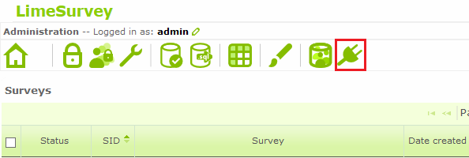
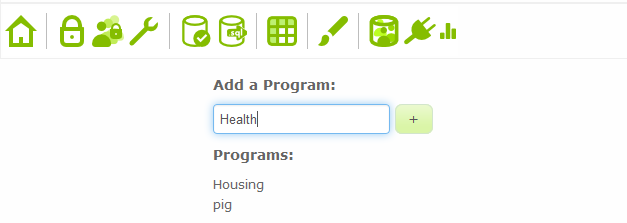
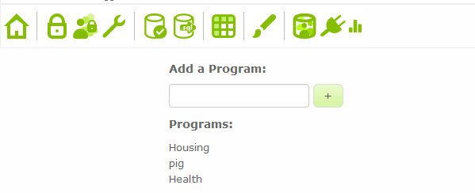

If this is your first time activating the plugin, or if you need to add a new program, please complete the following steps:

* If you are not already on the plugin page, click the plug-shaped icon in the top left part of the screen.

 

 

* On the next page, next to the same icon a small bar-chart icon will appear. Click on it.

* On the next page, there will be an _Add a Program_ section. Underneath that will be the list of programs that you have added previously. Enter the name of the program that you would like to add, ensure that it is spelled correctly, then click the button next to the text box.

 

 

* Your program should now have been added to the list of programs.

 

 