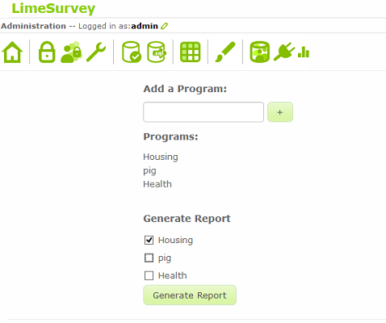

* Once the programs have been added and the necessary surveys have been tied to their programs, you can view accurate reports.

* Navigate to the plugin page by clicking the plug-shaped icon in the top left part of the screen. On the next page, a small bar-chart icon will appear next to the same icon. Click on it.

* In the _Generate Report_ section, select the program or programs for which you would like to view a report and click the _Generate Report_ button. The next page will show the necessary information and charts for your report.

 

