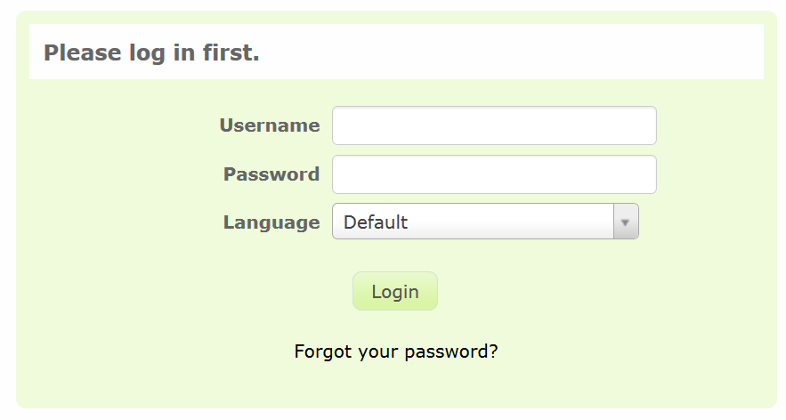

* Go to the link http://www.yourdomain.org/limesurvey/admin to access the login page

<!--Make sure to change the URL to match the location of the picture on the server-->
<!--

	

-->

* Enter your username and password
	* The default username will be _admin_
	* The default password will be _password_

* You will be directed to the home screen where you can start to create or manage your surveys

* For more information and for loggin in for the first time, please visit https://manual.limesurvey.org/First_login_-_Your_user_preferences
