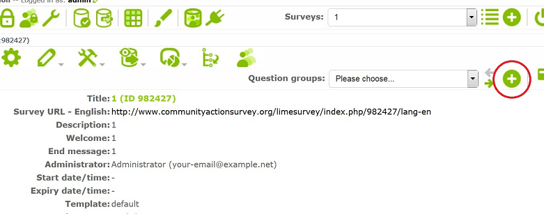
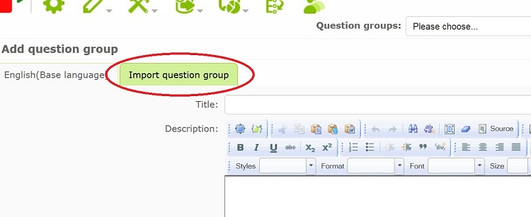
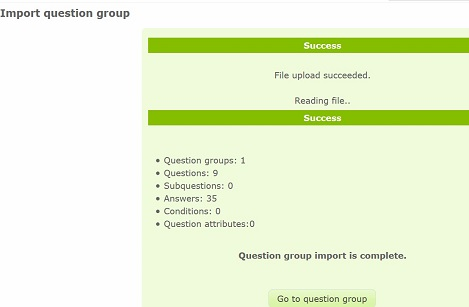
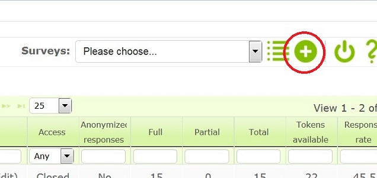

* To create a survey for a program you may want to include the core question group which is required for surveys for every program.

* To import a question group, first create a survey as in the <a href="http://communityactionsurvey.org/guide/index.php/Surveys/Creating_a_Survey">Creating a Survey</a> section

* After filling out the fields in the _General_ tab, click on _Save_ and you will be directed to a page with a summary of the current survey.

* Now you are supposed to make a question group. Click on the “+” to the right just above the summary next to the question groups drop down menu. (Not the “+” on the top right next to surveys drop down menu!).

* Since you want to import an existing question group, go to the _Import question group_ tab.

* Then browse and upload the question group file (.lsg).

* You can add or import question groups specific to a survey or program in this way as needed.

	* Instead, it is also possible to import an entire survey, though for the purposes of Community action, this is not recommended.

* To import a LimeSurvey survey file (.lss) you can create a complete survey in a few simple steps

* First click the “+” button on the top most bar beside the surveys dropdown menu.

* Once the create a survey screen has popped up, navigate to the _Import_ tab. Then click the _Browse_ button and find the .lss file.

* Once you have selected the file click the _Import survey_ button.

* You should then be redirected to a new screen telling you the upload was successful. You now should have a complete survey, unless you exported a survey without questions which you would then need to add a question group and questions too, as outlined in <a href="http://csserver.beloit.edu/~roehln/daux.io-master/index.php/Surveys/Creating_a_Survey">Create a Survey</a>.

For more information, please visit https://manual.limesurvey.org/Importing_a_survey_structure