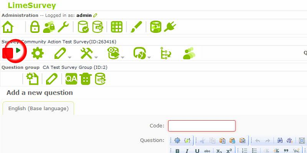

Note: Once you activate a survey you can no longer edit much of its content, such as the types of questions already inserted into the survey.  Therefore, be ensure that the survey is completed before continuing with the following steps.

* Once you have all of your questions in your question group, look for the red square on the left of the screen and click the green triangle next to it.

* This will take you to a new screen from which you can activate the survey. There will be a list of warnings on what you can no longer do once you have activated the survey along with a list of dropdowns for: 

	* **Anonymized Responses**
		* This option is recommended.  
	* **Date Stamps**
		* This option is required. The graphs in the report need the date and time the survey was completed.
	* **Saving the IP Address of the Survey Taker** 
		* This option is not needed, and may infringe on the anonymity of responses.
	* **Saving the Referral URL**
		* This option is not needed. A referrer URL is the URL from which the user was led to your survey URL. 
	* **Saving Timings**
		* This option is not needed. This option would collect how long the participants took on each page of the survey.

* Activate the survey by clicking the _Save / Activate Survey_ button at the bottom of the screen.

* After the button is clicked, you will be taken to a new screen which should tell you the survey has been activated. 

* There will be a prompt explaining that the survey can be taken by anyone, and a button on the bottom left to switch to closed-access mode where a user needs a token to take the survey.
	* We recommend that you choose _Closed-Access Mode_, so that only those you sent a token to may take the survey (i.e. your customers and clients)

* After you select which access mode you desire, you will be taken to a new screen with an overview of the survey’s details. Your survey is now active.

* For more information, please visit https://manual.limesurvey.org/Activating_a_survey
